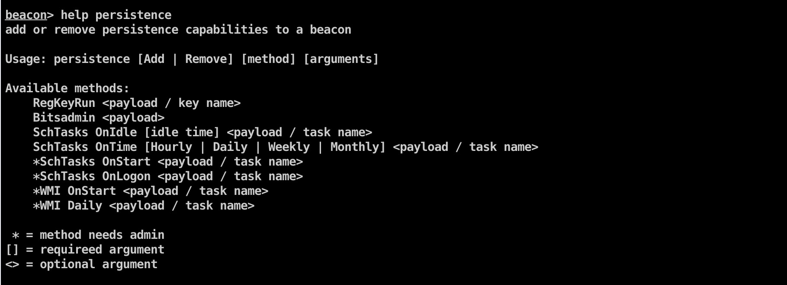

# cobalt-strike-persistence
本脚本基于[persistence-aggressor-script](https://github.com/ZonkSec/persistence-aggressor-script)修改而来

使用者通过cobalt strike生成Web Delivery类型的payload，然后加载此脚本可以到达自启动效果

提供以下几种自启动方式
**RegKeyRun
Bitsadmin
SchTasks
WMI**

其中在windows7 x64上测试 通过Bitsadmin 添加自启动后，360无提示